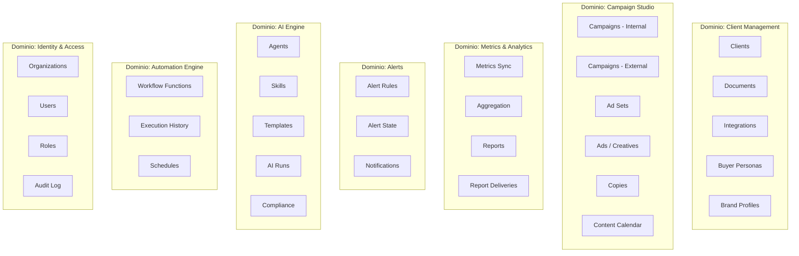
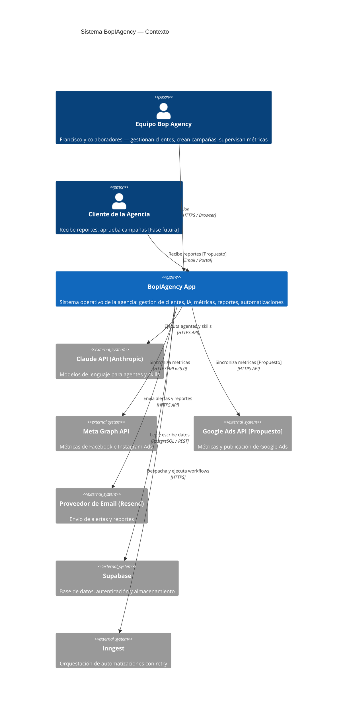
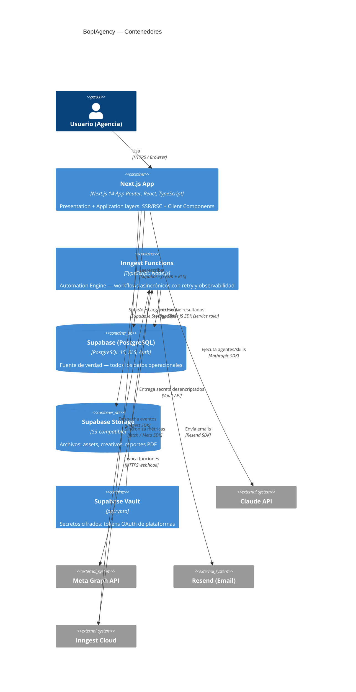
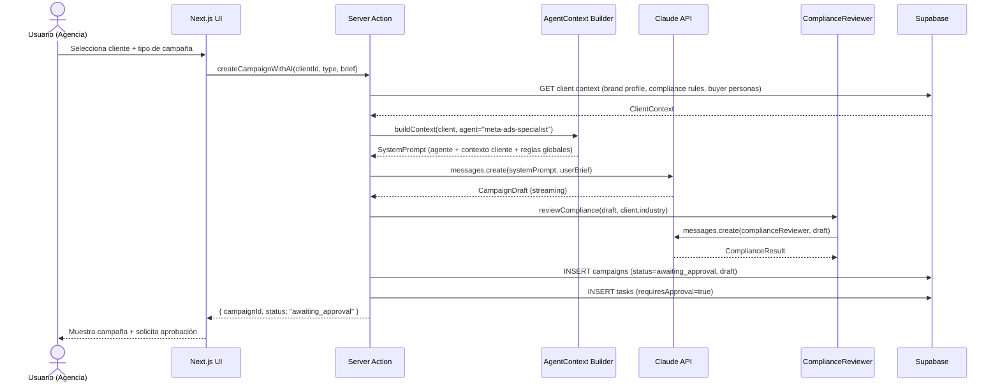
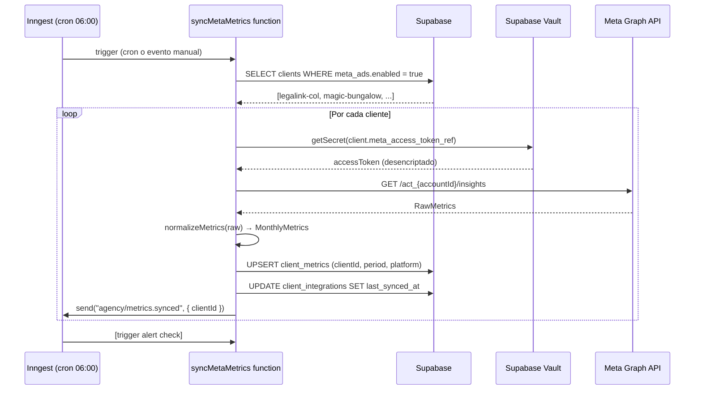
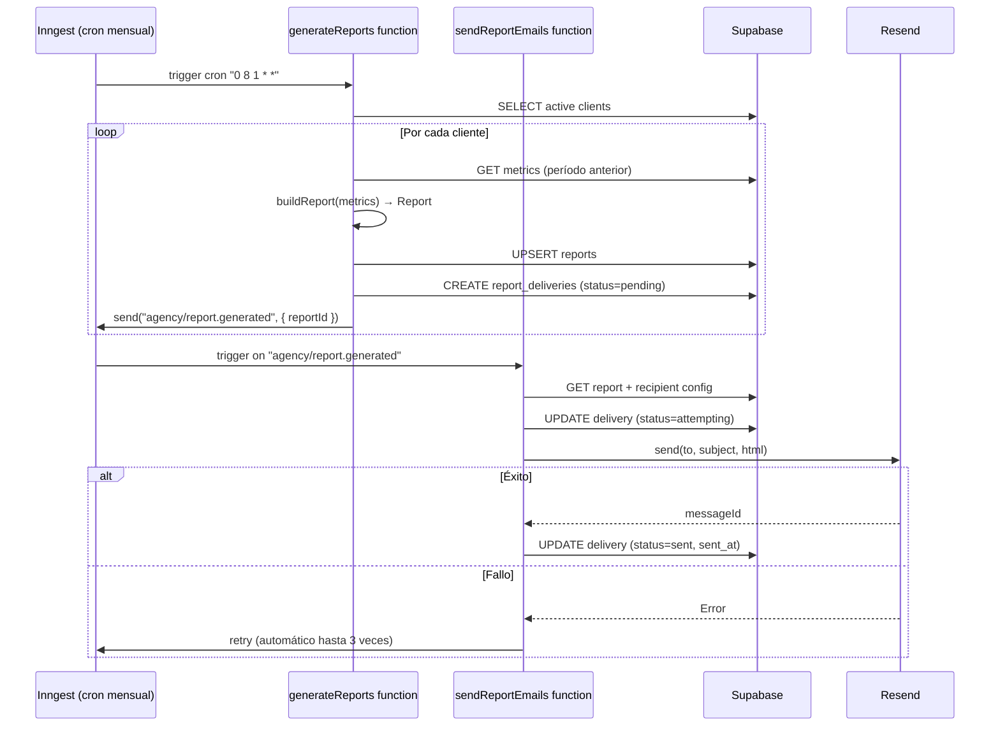
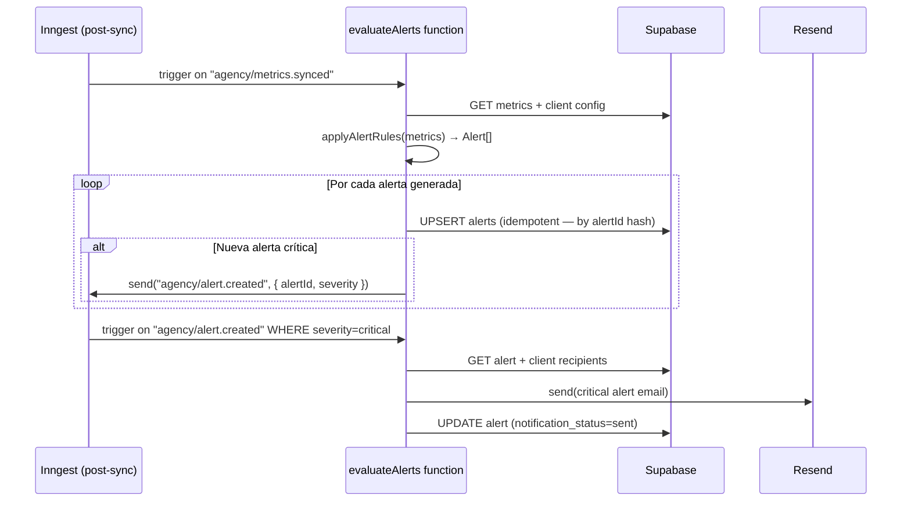
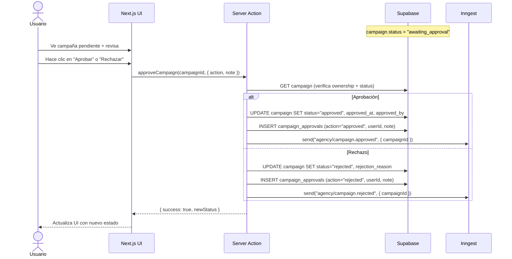
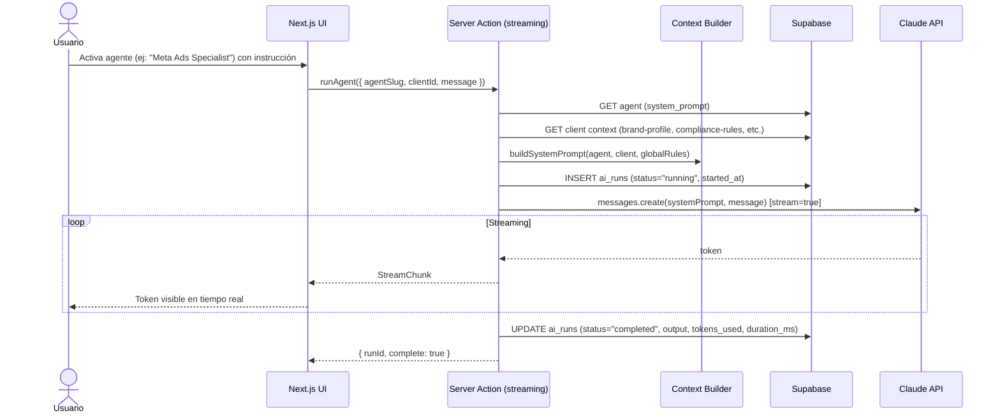
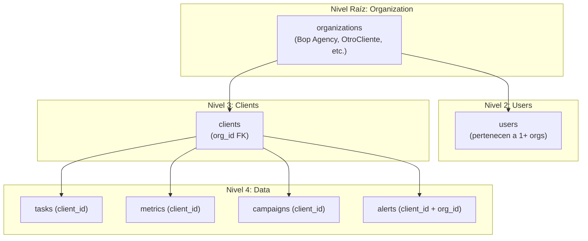

# ARCHITECTURE
## BopIAgency — Arquitectura Objetivo
**Fecha:** 2026-07-29  
**Estado:** Propuesta — pendiente de aprobación  
**Fuentes:** `docs/audit/` (auditoría completa del repositorio)

---

## 1. CONTEXTO DEL SISTEMA

BopIAgency es el sistema operativo digital de **Bop Agency**, una agencia de marketing digital con sede en Cali, Colombia que opera en Colombia, Estados Unidos y España. El sistema gestiona clientes de marketing, diseño, branding y automatización.

**Estado actual (Existente):**  
- Sistema de agentes AI sobre Claude Code (CLI) — no accesible vía web  
- Dashboard local React + Express — sin autenticación, sin base de datos  
- Automatizaciones n8n en Docker local — sin escalabilidad  
- Persistencia en archivos JSON y Markdown en disco local

**Estado objetivo (Propuesto):**  
- Web app multi-empresa, multi-cliente, responsive  
- Accesible desde cualquier dispositivo con autenticación  
- Agentes AI ejecutables desde la interfaz  
- Automatizaciones confiables con retry y observabilidad  
- Base de datos centralizada con control de acceso por rol

---

## 2. OBJETIVOS ARQUITECTÓNICOS

| ID | Objetivo | Prioridad |
|----|---------|-----------|
| OA-01 | La aplicación debe funcionar correctamente para múltiples empresas (multi-tenant) con aislamiento total de datos | 🔴 Crítico |
| OA-02 | Un agente o skill de IA debe poder ejecutarse desde la UI sin necesidad del CLI de Claude Code | 🔴 Crítico |
| OA-03 | Las automatizaciones deben tener retry automático y observabilidad de ejecuciones | 🔴 Crítico |
| OA-04 | Cualquier componente debe poder evolucionar sin romper los demás (separación por capas) | 🟠 Alta |
| OA-05 | El sistema debe soportar aprobación humana en flujos críticos (campañas, publicación) | 🟠 Alta |
| OA-06 | El proveedor de AI debe ser intercambiable sin cambiar la lógica de negocio | 🟠 Alta |
| OA-07 | La interfaz debe ser responsive y funcionar en móvil, tablet y desktop | 🟠 Alta |
| OA-08 | Toda acción que modifica datos debe quedar registrada en un log de auditoría | 🟡 Media |
| OA-09 | El sistema debe poder expandir plataformas de integración (Google Ads, GA4) sin cambiar el núcleo | 🟡 Media |
| OA-10 | El costo de IA debe ser rastreable por cliente y por sesión | 🟡 Media |

---

## 3. REQUISITOS FUNCIONALES

| ID | Requisito | Origen (evidencia) |
|----|----------|--------------------|
| RF-01 | Gestionar clientes con documentos (brand profile, buyer personas, compliance, etc.) | `clients/_template-client/` |
| RF-02 | Sincronizar métricas de Meta Ads diariamente | `backups/n8n-workflows/META - Sincronizar Métricas*.json` |
| RF-03 | Generar y enviar reportes semanales y mensuales por email | `server/services/reportService.ts` |
| RF-04 | Emitir y gestionar alertas con ciclo de vida completo | `server/schemas.ts` → `AlertSchema` |
| RF-05 | Ejecutar agentes y skills de IA con contexto del cliente activo | `.agencia-ai/.claude/agents/`, `.claude/skills/` |
| RF-06 | Gestionar tareas con estados, prioridades y aprobación | `server/schemas.ts` → `TaskSchema` |
| RF-07 | Crear campañas completas (Meta, Google, YouTube) con IA | `.agencia-ai/.claude/workflows/meta-ads-campaign.md` |
| RF-08 | Revisar campañas contra reglas de compliance por industria | `.agencia-ai/.claude/references/compliance-master-guide.md` |
| RF-09 | Registrar historial de ejecuciones de automatizaciones | `shared-data/automations/executions/` |
| RF-10 | Soportar múltiples empresas y múltiples clientes por empresa | Propuesto — no existe actualmente |
| RF-11 | Controlar acceso por roles (owner, admin, member, viewer) | Propuesto — no existe actualmente |
| RF-12 | Mantener historial de versiones de documentos de cliente | Propuesto |
| RF-13 | Publicar campañas en plataformas externas (Fase 11) | Propuesto |

---

## 4. REQUISITOS NO FUNCIONALES

| ID | Requisito | Métrica objetivo |
|----|----------|-----------------|
| RNF-01 | Tiempo de carga inicial (LCP) | < 2 segundos |
| RNF-02 | Disponibilidad | 99.5% mensual |
| RNF-03 | Tiempo de ejecución de un agente simple | < 30 segundos |
| RNF-04 | Aislamiento entre tenants | 0 fugas de datos entre organizaciones |
| RNF-05 | Cobertura de tests | > 70% en lógica de dominio |
| RNF-06 | Tiempo de recuperación ante fallo de automatización | Retry automático en < 5 minutos |
| RNF-07 | Datos sensibles (tokens OAuth) nunca en texto plano en DB | 100% en Supabase Vault |
| RNF-08 | Auditoría completa de mutaciones | 100% de acciones registradas |

---

## 5. LÍMITES DE DOMINIO

El sistema se divide en **7 dominios funcionales**:



---

## 6. DIAGRAMA DE CONTEXTO



---

## 7. DIAGRAMA DE CONTENEDORES



---

## 8. CAPAS DE LA ARQUITECTURA

La arquitectura sigue **Arquitectura Limpia** con separación estricta por capas. Las dependencias siempre apuntan hacia adentro (Shared Kernel ← Dominio ← Aplicación ← Infraestructura ← Presentación).

```
┌─────────────────────────────────────────────────────────────────┐
│  PRESENTATION LAYER (app/ — Next.js App Router)                 │
│  Server Components · Client Components · Server Actions         │
│  Pages · Layouts · UI Components (shadcn/ui + Tailwind)         │
├─────────────────────────────────────────────────────────────────┤
│  APPLICATION LAYER (lib/use-cases/ o lib/application/)          │
│  Use Cases · DTOs · Orquestación de dominios                    │
│  Validación de inputs (Zod) · Autorización por caso de uso      │
├──────────────────────────┬──────────────────────────────────────┤
│  AI ENGINE               │  AUTOMATION ENGINE                   │
│  (lib/ai/)               │  (inngest/functions/)                │
│  Agent Runner            │  Workflow Functions                  │
│  Skill Executor          │  Cron Triggers                       │
│  Context Builder         │  Event Dispatchers                   │
│  Prompt Templates        │  Retry Logic                         │
├──────────────────────────┴──────────────────────────────────────┤
│  DOMAIN LAYER (lib/domain/)                                     │
│  Entities · Value Objects · Domain Events · Business Rules      │
│  Interfaces (Ports): Repository, Provider, Dispatcher           │
├──────────────────────────────────────────────────────────────────┤
│  INFRASTRUCTURE LAYER (lib/infrastructure/)                     │
│  Supabase Adapters · Claude API Adapter · Meta Adapter          │
│  Resend Adapter · Storage Adapter · Inngest Adapter             │
├──────────────────────────────────────────────────────────────────┤
│  SHARED KERNEL (lib/shared/ o packages/shared/)                 │
│  Tipos compartidos · Zod Schemas · Utilidades · Errores base    │
│  Constantes · Formatters · Date utilities                       │
└─────────────────────────────────────────────────────────────────┘
```

### Estructura de monorepo propuesta (NO crear todavía)

```
bop-agency/                        ← raíz del monorepo
├── apps/
│   └── web/                       ← Next.js app principal
│       ├── app/                   ← App Router (pages, layouts, API routes)
│       ├── components/            ← UI Components
│       ├── lib/                   ← Application + Domain + Infrastructure
│       │   ├── domain/
│       │   ├── application/
│       │   ├── infrastructure/
│       │   ├── ai/
│       │   └── schemas/
│       └── inngest/               ← Automation Engine functions
├── packages/
│   ├── shared/                    ← Shared Kernel (tipos, utils, schemas base)
│   ├── ui/                        ← Design system compartido [Propuesto Fase 2+]
│   └── config/                    ← Configs compartidas (ESLint, TS, Tailwind)
├── docs/                          ← Documentación (existente)
├── legacy/                        ← agency-dashboard + shared-data [archivado]
└── package.json                   ← workspace root
```

---

## 9. INTERFACES (PUERTOS) PRINCIPALES

Todas las interfaces son **puertos del dominio** — definen el contrato sin acoplar a ninguna implementación concreta. Los adaptadores (implementaciones) viven en la capa de infraestructura.

```typescript
// === REPOSITORIOS ===

interface ClientRepository {
  findById(id: string, orgId: string): Promise<Client | null>;
  findAll(orgId: string, filters?: ClientFilters): Promise<Client[]>;
  create(data: CreateClientDTO, orgId: string): Promise<Client>;
  update(id: string, data: UpdateClientDTO, orgId: string): Promise<Client>;
  softDelete(id: string, orgId: string): Promise<void>;
}

interface CampaignRepository {
  findByClient(clientId: string, orgId: string, filters?: CampaignFilters): Promise<Campaign[]>;
  findById(id: string, orgId: string): Promise<Campaign | null>;
  create(data: CreateCampaignDTO): Promise<Campaign>;
  update(id: string, data: UpdateCampaignDTO): Promise<Campaign>;
  updateStatus(id: string, status: CampaignStatus): Promise<Campaign>;
}

interface MetricsRepository {
  findByClientAndPeriod(clientId: string, period: string, platform?: Platform): Promise<ClientMetrics | null>;
  findPeriodsByClient(clientId: string): Promise<string[]>;
  upsert(data: UpsertMetricsDTO): Promise<ClientMetrics>;
  getAggregateSummary(orgId: string): Promise<AgencyMetricsSummary>;
}

interface AlertRepository {
  findAll(orgId: string, filters?: AlertFilters): Promise<Alert[]>;
  findById(id: string): Promise<Alert | null>;
  create(data: CreateAlertDTO): Promise<Alert>;
  updateState(id: string, state: AlertStateUpdate): Promise<Alert>;
  findPendingNotifications(limit?: number): Promise<Alert[]>;
}

interface ReportRepository {
  findByClient(clientId: string, type?: ReportType): Promise<Report[]>;
  findByPeriod(clientId: string, type: ReportType, period: string): Promise<Report | null>;
  create(data: CreateReportDTO): Promise<Report>;
  findPendingDeliveries(filters?: DeliveryFilters): Promise<ReportDelivery[]>;
  updateDelivery(id: string, state: DeliveryStateUpdate): Promise<ReportDelivery>;
}

interface TaskRepository {
  findByClient(clientId: string, orgId: string, filters?: TaskFilters): Promise<Task[]>;
  findAll(orgId: string, filters?: TaskFilters): Promise<Task[]>;
  create(data: CreateTaskDTO): Promise<Task>;
  updateStatus(id: string, status: TaskStatus, meta?: TaskStatusMeta): Promise<Task>;
  logAction(entry: TaskAuditEntry): Promise<void>;
}

interface AgentRepository {
  findBySlug(slug: string, orgId?: string): Promise<Agent | null>;
  findAll(orgId?: string): Promise<Agent[]>;
  create(data: CreateAgentDTO): Promise<Agent>;
  update(id: string, data: UpdateAgentDTO): Promise<Agent>;
}

interface SkillRepository {
  findBySlug(slug: string, orgId?: string): Promise<Skill | null>;
  findAll(orgId?: string, category?: string): Promise<Skill[]>;
}

interface TemplateRepository {
  findBySlug(slug: string, orgId?: string): Promise<Template | null>;
  findAll(orgId?: string, category?: string): Promise<Template[]>;
}

interface AutomationRepository {
  findAll(orgId: string, filters?: AutomationFilters): Promise<Automation[]>;
  findById(id: string): Promise<Automation | null>;
  updateHealth(id: string, health: AutomationHealth): Promise<Automation>;
  logExecution(automationId: string, execution: ExecutionLog): Promise<void>;
  findExecutions(automationId: string, filters?: ExecutionFilters): Promise<ExecutionLog[]>;
}

// === PROVEEDORES ===

interface AIProvider {
  complete(params: AICompletionParams): Promise<AICompletionResult>;
  stream(params: AICompletionParams): AsyncIterable<string>;
  countTokens(text: string, model: string): Promise<number>;
  getAvailableModels(): Promise<AIModel[]>;
}

interface EmailProvider {
  send(params: SendEmailParams): Promise<EmailResult>;
  sendBatch(emails: SendEmailParams[]): Promise<EmailResult[]>;
}

interface StorageProvider {
  upload(path: string, file: Buffer, options?: UploadOptions): Promise<StorageResult>;
  download(path: string): Promise<Buffer>;
  getPublicUrl(path: string): string;
  delete(path: string): Promise<void>;
  list(prefix: string): Promise<StorageFile[]>;
}

interface MetricsProvider {
  // Abstracción genérica para cualquier plataforma publicitaria
  fetchAccountMetrics(params: FetchMetricsParams): Promise<RawPlatformMetrics>;
  fetchCampaignMetrics(params: FetchCampaignMetricsParams): Promise<RawCampaignMetrics[]>;
  validateCredentials(credentials: PlatformCredentials): Promise<boolean>;
}

interface AdvertisingPlatformProvider extends MetricsProvider {
  // Extensión para plataformas que soportan publicación
  createCampaign(data: CreateAdCampaignDTO): Promise<ExternalCampaign>;
  updateCampaign(id: string, data: UpdateAdCampaignDTO): Promise<ExternalCampaign>;
  pauseCampaign(id: string): Promise<void>;
  getAccount(accountId: string): Promise<AdAccount>;
}

interface WorkflowDispatcher {
  send(event: WorkflowEvent): Promise<void>;
  sendBatch(events: WorkflowEvent[]): Promise<void>;
}

// === TIPOS BASE ===

type Platform = 'meta_ads' | 'google_ads' | 'ga4' | 'search_console' | 'youtube' | 'manual';
type ReportType = 'monthly' | 'weekly';
type TaskStatus = 'idea' | 'pending' | 'awaiting_approval' | 'approved' | 'in_progress' | 'in_review' | 'blocked' | 'completed' | 'cancelled';
type AlertSeverity = 'critical' | 'warning' | 'info';
type CampaignStatus = 'draft' | 'awaiting_approval' | 'approved' | 'active' | 'paused' | 'completed' | 'rejected';
```

---

## 10. FLUJOS PRINCIPALES

### 10.1 Flujo de Creación de Campaña con IA



### 10.2 Flujo de Sincronización de Métricas



### 10.3 Flujo de Generación y Envío de Reportes



### 10.4 Flujo de Alertas



### 10.5 Flujo de Aprobación Humana



### 10.6 Flujo de Ejecución de Agente



---

## 11. ESTRATEGIA MULTI-EMPRESA



**Principios:**
- Toda tabla operacional tiene `org_id` o llega a él vía `client_id` → `clients.org_id`
- **RLS aplica en todas las tablas** usando `auth.uid()` → `user_org_memberships` → `org_id`
- Un usuario puede pertenecer a **múltiples organizaciones** con roles distintos por organización
- La API siempre valida `org_id` antes de ejecutar cualquier operación

---

## 12. ESTRATEGIA MULTI-CLIENTE

- Cada cliente pertenece a exactamente una organización
- Los documentos del cliente (brand profile, buyer personas, etc.) se almacenan en la tabla `client_documents` con `(client_id, key)` como clave compuesta
- El contexto de cliente se construye **dinámicamente** al ejecutar cualquier agente: se cargan solo los documentos necesarios para esa operación
- El sistema soporta **contextos paralelos**: un usuario puede tener múltiples tabs con distintos clientes abiertos — cada request incluye el `clientId` explícito, sin estado global

---

## 13. AUTENTICACIÓN

**Proveedor:** Supabase Auth (existente — Propuesto para la nueva app)

**Flujos soportados:**
- Email + contraseña
- Magic link (email)
- OAuth (Google) — Propuesto para conveniencia del equipo

**Implementación en Next.js:**
```
middleware.ts → verifica sesión Supabase → redirige a /login si no autenticado
app/(auth)/login → Supabase Auth UI o custom form
app/(dashboard)/ → layout protegido por middleware
```

**Tokens:**
- Access token: JWT de corta duración (1h por defecto)
- Refresh token: rotación automática via Supabase
- Server Components usan `createServerClient()` con cookies
- Client Components usan `createBrowserClient()` con sesión hidratada

---

## 14. AUTORIZACIÓN Y ROLES

| Rol | Descripción | Capacidades |
|-----|-------------|------------|
| `owner` | Dueño de la organización | Todo — incluyendo billing, eliminar org |
| `admin` | Administrador | Gestionar usuarios, clientes, automatizaciones |
| `member` | Miembro del equipo | Crear/editar clientes, campañas, tareas, ejecutar agentes |
| `viewer` | Solo lectura | Ver dashboards, reportes y métricas. Sin edición |

**Control de acceso:**
- Nivel de datos: **RLS en Supabase** — primero línea de defensa
- Nivel de API: **verificación en Server Actions** — segunda línea de defensa
- Acciones que requieren rol específico usan `requireRole(userId, orgId, 'admin')` antes de ejecutar

---

## 15. AUDITORÍA

Toda mutación de datos significativa genera una entrada en la tabla `audit_log`:

```
audit_log {
  id, org_id, user_id, entity_type, entity_id,
  action, changes (jsonb: { before, after }),
  ip_address, user_agent, created_at
}
```

**Eventos auditados (mínimo):** login, client.created, client.updated, campaign.approved, campaign.rejected, task.status_changed, alert.resolved, report.sent, agent.run

**Retención:** 90 días en caliente (PostgreSQL), exportable a CSV para retención larga.

---

## 16. OBSERVABILIDAD

| Capa | Herramienta | Qué medir |
|------|------------|-----------|
| Frontend | Vercel Analytics | Web Vitals, errores de cliente |
| API/Backend | Next.js logs → Vercel | Latencia de Server Actions, errores 5xx |
| Automatizaciones | Inngest Dashboard | Ejecuciones, fallos, retries, duración |
| AI Runs | Tabla `ai_runs` en Supabase | Tokens usados, duración, errores, costo estimado |
| DB | Supabase Dashboard | Query performance, connections, pg_stat |
| Alertas de sistema | Inngest + email | Fallos repetidos de workflows críticos |

---

## 17. MANEJO DE ERRORES

**Principios:**
- Los errores de dominio son tipos explícitos, no excepciones genéricas
- Los errores de infraestructura se mapean a errores de dominio antes de llegar a la capa de aplicación
- La capa de presentación nunca recibe stack traces en producción

```typescript
// Jerarquía de errores (Propuesto)
class DomainError extends Error { constructor(message: string, public readonly code: string) }
class NotFoundError extends DomainError { }
class UnauthorizedError extends DomainError { }
class ValidationError extends DomainError { constructor(message: string, public readonly fields: Record<string, string>) }
class ExternalServiceError extends DomainError { constructor(message: string, public readonly service: string) }
```

**En Server Actions:** `try/catch` → retornar `{ success: false, error: { code, message } }`  
**En Inngest functions:** el error se propaga y Inngest hace retry automático según política configurada

---

## 18. IDEMPOTENCIA

Crítica para automatizaciones que pueden ejecutarse más de una vez:

- Las métricas usan `UPSERT` con `(client_id, period, platform)` como clave única
- Las alertas usan un `alert_id` determinístico basado en `hash(client_id + type + period)`
- Las entregas de reportes verifican `status != 'sent'` antes de enviar
- Los ai_runs tienen un `idempotency_key` opcional pasado por el cliente

---

## 19. REINTENTOS

**En Inngest functions:**
```typescript
// Política de retry por función
{ id: "sync-meta-metrics", retries: 3 }       // 3 reintentos con backoff exponencial
{ id: "send-alert-emails", retries: 5 }        // 5 reintentos para emails
{ id: "generate-reports", retries: 2 }         // 2 reintentos para generación
```

**En API Calls externas (Meta, Claude):**  
Implementar retry con exponential backoff en el adaptador de infraestructura, antes de que el error llegue al dominio.

---

## 20. SEGURIDAD

| Amenaza | Mitigación |
|---------|-----------|
| Acceso no autenticado | Middleware Next.js — toda ruta bajo `(dashboard)` requiere sesión |
| Escalación de privilegios | RLS en Supabase — segundo muro incluso si el app falla |
| Fugas de datos entre tenants | `org_id` en todas las queries + RLS con `auth.uid()` |
| Inyección SQL | Supabase JS SDK — queries parametrizadas |
| Tokens de terceros expuestos | Supabase Vault — nunca en columnas JSONB normales |
| CSRF | Next.js Server Actions usan tokens de sesión automáticamente |
| XSS | React escapa HTML por defecto; `dangerouslySetInnerHTML` prohibido |
| Secretos en código | Variables de entorno + `.env.local` en `.gitignore` |
| N8N_ENCRYPTION_KEY expuesta | **Acción inmediata pre-migración** — ver `MIGRATION_RISKS.md` R-02 |

---

## 21. GESTIÓN DE SECRETOS

```
Secreto                           Dónde vive
──────────────────────────────────────────────────────────────
ANTHROPIC_API_KEY                 .env.local → Vercel Env Vars
NEXT_PUBLIC_SUPABASE_ANON_KEY     .env.local → Vercel Env Vars
SUPABASE_SERVICE_ROLE_KEY         .env.local → Vercel Env Vars (server-only)
INNGEST_SIGNING_KEY               .env.local → Vercel Env Vars
RESEND_API_KEY                    .env.local → Vercel Env Vars
Meta Access Tokens (por cliente)  Supabase Vault (cifrado en DB)
Google OAuth Tokens (por cliente) Supabase Vault (cifrado en DB)
```

**Regla:** Ningún secreto de tercero por cliente vive en una columna JSONB sin cifrar.

---

## 22. ESTRATEGIA DE ARCHIVOS / STORAGE

| Tipo de archivo | Dónde | Acceso |
|----------------|-------|--------|
| Assets de cliente (logos, imágenes) | Supabase Storage `/clients/{orgId}/{clientId}/assets/` | Privado — URL firmada |
| Creativos de campaña | Supabase Storage `/campaigns/{campaignId}/creatives/` | Privado — URL firmada |
| Reportes PDF generados | Supabase Storage `/reports/{clientId}/{period}/` | Privado — URL firmada |
| Documentos Markdown (brand profile, etc.) | Tabla `client_documents` (columna `content: text`) | Via DB — no Storage |
| Importaciones de datos (CSV de métricas) | Supabase Storage `/imports/` (temporal) | Privado — eliminar tras procesar |

---

## 23. ESTRATEGIA DE CACHÉ

| Datos | Estrategia | TTL |
|-------|-----------|-----|
| Lista de clientes | `unstable_cache` de Next.js (React Cache) | 60 segundos |
| Métricas del período actual | `unstable_cache` + revalidación en on-demand | 5 minutos |
| Agentes y skills (rara vez cambian) | `unstable_cache` | 1 hora |
| Documentos del cliente | Sin caché — siempre frescos | N/A |
| Reportes generados | Cache de respuesta HTTP (Content-Type: JSON) | Inmutable por período |

---

## 24. ESTRATEGIA DE PRUEBAS

| Nivel | Herramienta | Qué testear |
|-------|------------|------------|
| Unitarios | Vitest | Lógica de dominio (generación de alertas, normalización de métricas, validación de schemas Zod) |
| Integración | Vitest + Supabase local | Repositorios, servicios con DB real |
| E2E | Playwright | Flujos críticos: login, crear cliente, aprobar campaña, ver métricas |
| AI | Evaluaciones (Promptfoo o custom) | Calidad de output de agentes con casos conocidos |
| Automatizaciones | Inngest Dev Server | Ejecución local de functions con eventos mock |

**Cobertura mínima objetivo:** 70% en `lib/domain/` y `lib/application/`

---

## 25. ESTRATEGIA RESPONSIVE

- **Diseño mobile-first** con Tailwind CSS breakpoints: `sm` (640px), `md` (768px), `lg` (1024px), `xl` (1280px)
- **Sidebar colapsable** en móvil (overlay drawer) — visible como sidebar fijo en desktop
- **Tablas de datos** → convertirse en cards apiladas en pantallas < 768px
- **Gráficas** (Recharts) → responsive container con `width="100%"`
- **Formularios AI** → full-width en móvil, max-width en desktop
- **Viewport meta tag** obligatorio en root layout

---

## 26. ESTRATEGIA DE MIGRACIÓN GRADUAL

La migración ocurre en paralelo con la operación actual:

1. **n8n continúa operativo** hasta que Inngest esté validado en staging
2. **La Express API continúa operativa** hasta que Next.js API Routes cubran todos los endpoints
3. **Los archivos JSON en `shared-data/`** continúan siendo la fuente de verdad durante la transición
4. **Los clientes se migran uno por uno** a Supabase — primero `cliente-prueba`, luego `legalink-col`, luego `magic-bungalow`
5. **Rollback disponible** en todo momento: los archivos JSON nunca se eliminan hasta confirmar integridad en Supabase

Ver `docs/architecture/IMPLEMENTATION_ROADMAP.md` para el plan detallado por fases.

---

*Propuesta de arquitectura — 2026-07-29. Pendiente de revisión y aprobación antes de implementar.*
